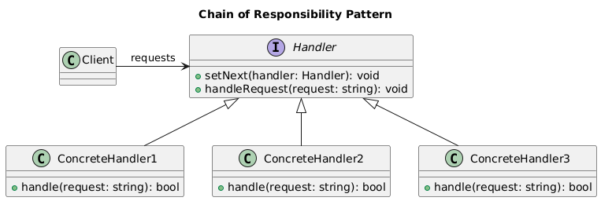

# Chain of Responsibility

Let us consider the below example.

## Incident Support Example

- **Basic Support:** Handles general queries, FAQs, and minor issues.
- **Technical Support:** Handles technical issues, such as bugs or system malfunctions.
- **Manager Support:** Handles escalations or major issues that can't be resolved at lower levels.

### Without Chain of Responsibility

```cpp
#include <iostream>
#include <string>

enum IssueLevel { GENERAL, TECHNICAL, ESCALATION };

class SupportHandler {
public:
    // lots of if statements, extensibility is low & high tigh coupling
    void handleRequest(IssueLevel level, const std::string& issue) {
        if (level == GENERAL) {
            handleGeneral(issue);
        } else if (level == TECHNICAL) {
            handleTechnical(issue);
        } else if (level == ESCALATION) {
            handleEscalation(issue);
        }
    }

private:
    void handleGeneral(const std::string& issue) {
        std::cout << "Basic support handling issue: " << issue << std::endl;
    }

    void handleTechnical(const std::string& issue) {
        std::cout << "Technical support handling issue: " << issue << std::endl;
    }

    void handleEscalation(const std::string& issue) {
        std::cout << "Manager handling issue: " << issue << std::endl;
    }
};

int main() {
    SupportHandler support;
    support.handleRequest(GENERAL, "Password reset issue");
    support.handleRequest(TECHNICAL, "Application crash issue");
    support.handleRequest(ESCALATION, "Customer complaint");

    return 0;
}
```

**Problems with This Approach:**

- **Tight coupling:** The SupportHandler class handles all the logic for resolving issues at different levels. Any new support level (e.g., billing support) will require modifications to the existing class.
- **Difficult to extend:** Adding new handlers or modifying the flow of responsibility requires altering the entire class, leading to code complexity.

### With Chain of Responsibility

```cpp
#include <iostream>
#include <string>
#include <memory>

enum IssueLevel { GENERAL, TECHNICAL, ESCALATION };

class SupportHandler {
public:
    virtual ~SupportHandler() = default;
    void setNext(std::shared_ptr<SupportHandler> nextHandler) {
        next = nextHandler;
    }

    void handleRequest(IssueLevel level, const std::string& issue) {
        if (canHandle(level)) {
            processRequest(issue);
        } else if (next) {
            next->handleRequest(level, issue);
        }
    }

protected:
    virtual bool canHandle(IssueLevel level) = 0;
    virtual void processRequest(const std::string& issue) = 0;

private:
    std::shared_ptr<SupportHandler> next;
};

class BasicSupport : public SupportHandler {
protected:
    bool canHandle(IssueLevel level) override {
        return level == GENERAL;
    }

    void processRequest(const std::string& issue) override {
        std::cout << "Basic support handling issue: " << issue << std::endl;
    }
};

class TechnicalSupport : public SupportHandler {
protected:
    bool canHandle(IssueLevel level) override {
        return level == TECHNICAL;
    }

    void processRequest(const std::string& issue) override {
        std::cout << "Technical support handling issue: " << issue << std::endl;
    }
};

class ManagerSupport : public SupportHandler {
protected:
    bool canHandle(IssueLevel level) override {
        return level == ESCALATION;
    }

    void processRequest(const std::string& issue) override {
        std::cout << "Manager handling escalated issue: " << issue << std::endl;
    }
};

int main() {
    auto basicSupport = std::make_shared<BasicSupport>();
    auto technicalSupport = std::make_shared<TechnicalSupport>();
    auto managerSupport = std::make_shared<ManagerSupport>();

    // Setting up the chain of responsibility
    basicSupport->setNext(technicalSupport);
    technicalSupport->setNext(managerSupport);

    // Handling requests
    basicSupport->handleRequest(GENERAL, "Password reset issue");
    basicSupport->handleRequest(TECHNICAL, "Application crash issue");
    basicSupport->handleRequest(ESCALATION, "Customer complaint");

    return 0;
}
```

**Advantages of Using Chain of Responsibility Pattern:**

- **Flexibility:** You can easily change the chain of support levels, add new levels, or modify existing ones without touching other parts of the system.
- **Decoupling:** Each support handler is independent, which makes the system more modular and maintainable.
- **Extensibility:** New support levels, such as billing or premium support, can be added without affecting the other levels.

## Description

The Chain of Responsibility pattern is a behavioral design pattern that allows an object to pass a request along a chain of potential handlers until the request is handled. Each handler in the chain either processes the request or passes it to the next handler.

## Class Diagram


