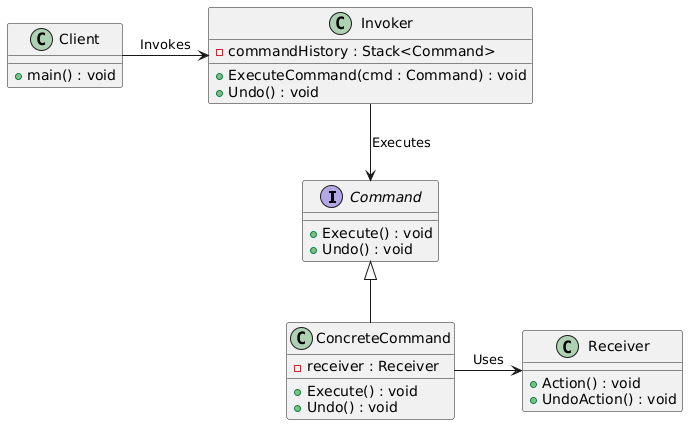

# Command Pattern

Let us consider the following example.

## Copy and Paste in Text Editor

Consider a simple example where a text editor application has buttons for "Copy" and "Paste" operations. 

### Without Command Pattern

Without the Command Pattern, you might directly invoke methods on the editor:

```cpp
#include <iostream>

class TextEditor {
public:
    void Copy() {
        std::cout << "Text Copied" << std::endl;
    }

    void Paste() {
        std::cout << "Text Pasted" << std::endl;
    }
};

int main() {
    TextEditor editor;
    editor.Copy();
    editor.Paste();
    return 0;
}
```

**Problems Without the Command Pattern:**

- **Tight Coupling:** The `main()` function directly calls the methods of `TextEditor`, leading to tight coupling between the `invoker` and the `receiver`.
- **Scalability Issues:** Adding more operations like `"Undo"` or `"Redo"` would require changing the code in the invoker (main), making it hard to maintain.
- **No Undo/Redo Mechanism:** There’s no built-in way to undo the operations.

### With Command Pattern

Now, let's apply the Command Pattern to decouple the invoker from the receiver and allow for easier operation extensions, such as undoing commands.

```cpp
#include <iostream>
#include <stack>
#include <memory>

// Command Interface
class Command {
public:
    virtual void Execute() = 0;
    virtual void Undo() = 0;
    virtual ~Command() = default;
};

// Receiver
class TextEditor {
public:
    void Copy() {
        std::cout << "Text Copied" << std::endl;
    }

    void Paste() {
        std::cout << "Text Pasted" << std::endl;
    }

    void UndoCopy() {
        std::cout << "Undo Copy Operation" << std::endl;
    }

    void UndoPaste() {
        std::cout << "Undo Paste Operation" << std::endl;
    }
};

// Concrete Command for Copy
class CopyCommand : public Command {
private:
    TextEditor& editor;
public:
    CopyCommand(TextEditor& editor) : editor(editor) {}

    void Execute() override {
        editor.Copy();
    }

    void Undo() override {
        editor.UndoCopy();
    }
};

// Concrete Command for Paste
class PasteCommand : public Command {
private:
    TextEditor& editor;
public:
    PasteCommand(TextEditor& editor) : editor(editor) {}

    void Execute() override {
        editor.Paste();
    }

    void Undo() override {
        editor.UndoPaste();
    }
};

// Invoker
class CommandInvoker {
private:
    std::stack<std::unique_ptr<Command>> commandHistory;
public:
    void ExecuteCommand(std::unique_ptr<Command> command) {
        command->Execute();
        commandHistory.push(std::move(command));
    }

    void Undo() {
        if (!commandHistory.empty()) {
            commandHistory.top()->Undo();
            commandHistory.pop();
        }
    }
};

// Client
int main() {
    TextEditor editor;
    CommandInvoker invoker;

    invoker.ExecuteCommand(std::make_unique<CopyCommand>(editor));
    invoker.ExecuteCommand(std::make_unique<PasteCommand>(editor));

    invoker.Undo(); // Undo Paste
    invoker.Undo(); // Undo Copy

    return 0;
}
```

**Benefits of Using the Command Pattern:**

- **Decoupling:** The invoker doesn’t need to know the details of the operations. It only needs to know the command interface.
- **Command History:** The command history can be maintained to support undo and redo operations.
- **Extensibility:** New commands can be added easily without changing the invoker or client code.

## Description

The Command Pattern is a behavioral design pattern that turns a request into a stand-alone object containing all the information about the request. This transformation allows for parameterization of methods with different requests, queuing of requests, and logging of the requests. It also provides support for undoable operations.

## Class Diagram


