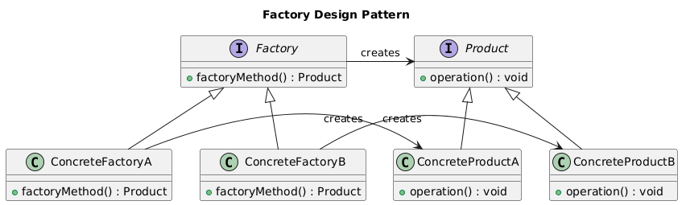
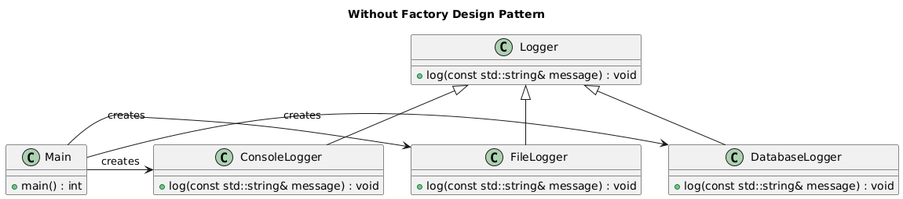
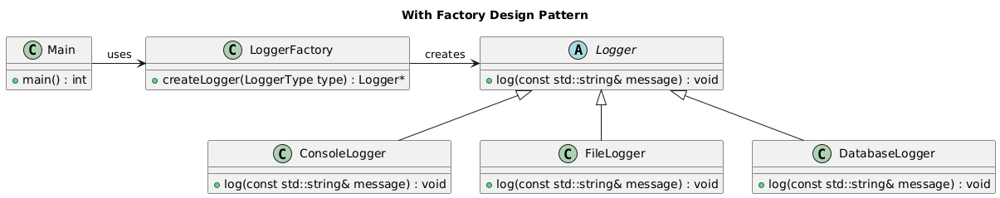

# Factory Design Pattern

- The Factory Design Pattern is a creational design pattern that provides a way to create objects without specifying the exact class of object that will be created.
- It is a design pattern that provides a way to encapsulate the creation of objects.
- This pattern is particularly useful when the exact type of the object that needs to be created is determined at runtime.

## Class Diagram



### Description

- Factory Interface: The `Factory` interface declares the `factoryMethod()` that returns a `Product`. This is the core component responsible for defining the method that creates objects.
- `ConcreteFactoryA` and `ConcreteFactoryB`: These are concrete implementations of the `Factory` interface. Each subclass implements the `factoryMethod()` to create and return an instance of the appropriate `ConcreteProduct`.
- Product Interface: The `Product` interface defines the operations that all concrete products must implement.
- `ConcreteProductA` and `ConcreteProductB`: These are concrete implementations of the `Product` interface, representing different types of products.

## Logger Example

Let's consider an example of a logging system that supports different types of loggers: `ConsoleLogger`, `FileLogger`, and `DatabaseLogger`. We want to write a system that can log messages to different destinations based on the configuration.

### Without Factory Pattern

```cpp
// Logger.h
class Logger {
public:
    virtual void log(const std::string& message) = 0;
};

// ConsoleLogger.h
class ConsoleLogger : public Logger {
public:
    void log(const std::string& message) override {
        std::cout << "Console: " << message << std::endl;
    }
};

// FileLogger.h
class FileLogger : public Logger {
public:
    void log(const std::string& message) override {
        std::ofstream file("log.txt", std::ios::app);
        file << "File: " << message << std::endl;
        file.close();
    }
};

// DatabaseLogger.h
class DatabaseLogger : public Logger {
public:
    void log(const std::string& message) override {
        std::cout << "Database: " << message << std::endl; // Simulating database logging
    }
};

// main.cpp
int main() {
    // Creating objects directly
    ConsoleLogger consoleLogger;
    FileLogger fileLogger;
    DatabaseLogger databaseLogger;

    consoleLogger.log("Hello, Console!");
    fileLogger.log("Hello, File!");
    databaseLogger.log("Hello, Database!");

    // To change the logger, we need to modify the code
    // and rebuild the system
    // consoleLogger.log("Hello, Console!"); // Change this line

    return 0;
}
```

In the above code, we are directly creating objects of `ConsoleLogger`, `FileLogger`, and `DatabaseLogger` classes. This approach has several drawbacks:

- **Tight Coupling:** The main function is tightly coupled with the logger classes. If we want to change the logger, we need to modify the main function.
- **Inflexibility:** We cannot change the logger at runtime.

#### Class Diagram 



### With Factory Pattern

```cpp
// Logger.h
class Logger {
public:
    virtual void log(const std::string& message) = 0;
    virtual ~Logger() {}
};

// ConsoleLogger.h
class ConsoleLogger : public Logger {
public:
    void log(const std::string& message) override {
        std::cout << "Console: " << message << std::endl;
    }
};

// FileLogger.h
class FileLogger : public Logger {
public:
    void log(const std::string& message) override {
        std::ofstream file("log.txt", std::ios::app);
        file << "File: " << message << std::endl;
        file.close();
    }
};

// DatabaseLogger.h
class DatabaseLogger : public Logger {
public:
    void log(const std::string& message) override {
        std::cout << "Database: " << message << std::endl; // Simulating database logging
    }
};

// LoggerFactory.h
class LoggerFactory {
public:
    enum LoggerType {
        CONSOLE_LOGGER,
        FILE_LOGGER,
        DATABASE_LOGGER
    };

    static Logger* createLogger(LoggerType type) {
        switch (type) {
            case CONSOLE_LOGGER:
                return new ConsoleLogger();
            case FILE_LOGGER:
                return new FileLogger();
            case DATABASE_LOGGER:
                return new DatabaseLogger();
            default:
                throw std::invalid_argument("Invalid logger type");
        }
    }
};

// main.cpp
int main() {
    // Using Factory to create objects
    Logger* logger = LoggerFactory::createLogger(LoggerFactory::CONSOLE_LOGGER);
    logger->log("Hello, Console!");
    delete logger;

    logger = LoggerFactory::createLogger(LoggerFactory::FILE_LOGGER);
    logger->log("Hello, File!");
    delete logger;

    logger = LoggerFactory::createLogger(LoggerFactory::DATABASE_LOGGER);
    logger->log("Hello, Database!");
    delete logger;

    // To change the logger, we just need to change the enum value
    // logger = LoggerFactory::createLogger(LoggerFactory::FILE_LOGGER); // Change this line

    return 0;
}
```

In the above code, we have introduced a `LoggerFactory` class with a static method `createLogger()` that returns a Logger object based on the `LoggerType` enum value.

The benefits of using the Factory Design Pattern are:

- **Loose Coupling:** The main function is loosely coupled with the logger classes. We can change the logger without modifying the main function.
- **Flexibility:** We can change the logger at runtime by changing the enum value.

#### Class Diagram



## Example Use Cases

- **Database Connection:** We can use the Factory Design Pattern to create database connections. The factory method can return a connection object based on the database type (e.g., MySQL, PostgreSQL, Oracle).
- **Logger:** We can use the Factory Design Pattern to create logger objects. The factory method can return a logger object based on the logging level (e.g., Debug, Info, Error).
- **Parser:** We can use the Factory Design Pattern to create parser objects. The factory method can return a parser object based on the file format (e.g., JSON, XML, CSV).