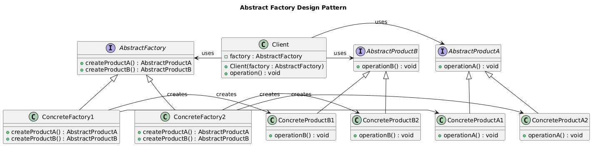
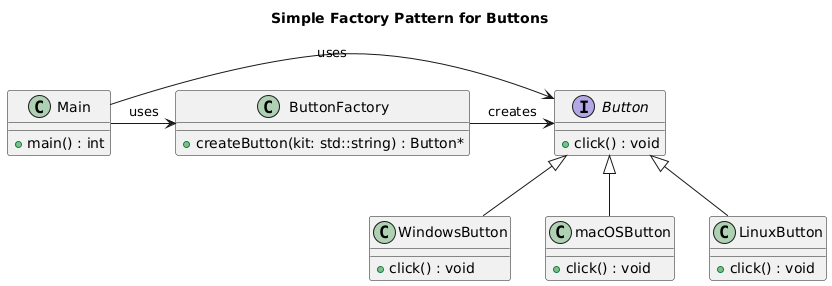
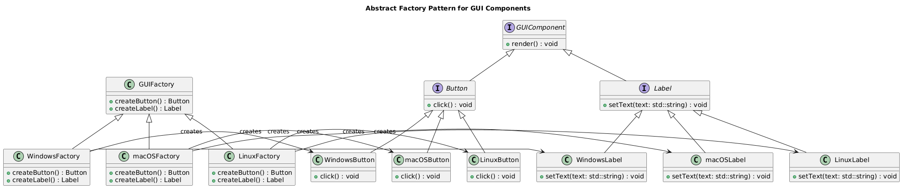

# Abstract Factory Design Pattern

- The Abstract Factory design pattern is a creational design pattern that provides a way to create families of related objects without specifying their concrete classes.

## Class Diagram

**Note:** Only go through this class digram after understanding the Button example given below.



### Explanation

1. `AbstractProductA` and `AbstractProductB`:

    - These are the interfaces or abstract classes for the products that the factories will create. Each product family (`ProductA` and `ProductB`) has its own interface.
2. `ConcreteProductA1`, `ConcreteProductA2`, `ConcreteProductB1`, and `ConcreteProductB2`:

    - These are concrete implementations of the abstract products. For example, `ConcreteProductA1` is one variant of `AbstractProductA`, and `ConcreteProductA2` is another.
3. `AbstractFactory`:

    - This is the interface for creating families of related or dependent products. It declares methods for creating each abstract product.
4. `ConcreteFactory1` and `ConcreteFactory2`:

    - These are concrete implementations of the `AbstractFactory` interface. Each factory creates a specific variant of each product. For example, `ConcreteFactory1` creates `ConcreteProductA1` and `ConcreteProductB1`, while `ConcreteFactory2` creates `ConcreteProductA2` and `ConcreteProductB2`.
5. Client:

    - The client uses the abstract factory to create products. The client is only aware of the abstract interfaces (`AbstractProductA`, `AbstractProductB`, and `AbstractFactory`) and doesn't know about the concrete products or factories, which promotes loose coupling.

## Button Example

Let's consider an example of a GUI component library that supports different GUI kits (e.g., Windows, macOS, Linux).

Let us start from **Factory Method**

```C++
// Button.h
class Button {
public:
    virtual void click() = 0;
};

// WindowsButton.h
class WindowsButton : public Button {
public:
    void click() override {
        std::cout << "Windows Button clicked" << std::endl;
    }
};

// macOSButton.h
class macOSButton : public Button {
public:
    void click() override {
        std::cout << "macOS Button clicked" << std::endl;
    }
};

// LinuxButton.h
class LinuxButton : public Button {
public:
    void click() override {
        std::cout << "Linux Button clicked" << std::endl;
    }
};

// ButtonFactory.h
class ButtonFactory {
public:
    static Button* createButton(const std::string& kit) {
        if (kit == "Windows") {
            return new WindowsButton();
        } else if (kit == "macOS") {
            return new macOSButton();
        } else if (kit == "Linux") {
            return new LinuxButton();
        } else {
            throw std::invalid_argument("Invalid GUI kit");
        }
    }
};

// main.cpp
int main() {
    Button* button = ButtonFactory::createButton("Windows");
    button->click();
    delete button;

    return 0;
}
```

### Class Diagram



In this example, the `ButtonFactory` class provides a single factory method `createButton()` that returns a `Button` object based on the GUI kit.

What if we are not having just a `Button`, but we are having `Button` and `Label` and many more `GUI` Components, there comes the Abstract Factory.

**Abstract Factory:**

```C++
// GUIComponent.h
class GUIComponent {
public:
    virtual void render() = 0;
};

// Button.h
class Button : public GUIComponent {
public:
    virtual void click() = 0;
};

// Label.h
class Label : public GUIComponent {
public:
    virtual void setText(const std::string& text) = 0;
};

// WindowsButton.h
class WindowsButton : public Button {
public:
    void click() override {
        std::cout << "Windows Button clicked" << std::endl;
    }
};

// WindowsLabel.h
class WindowsLabel : public Label {
public:
    void setText(const std::string& text) override {
        std::cout << "Windows Label: " << text << std::endl;
    }
};

// macOSButton.h
class macOSButton : public Button {
public:
    void click() override {
        std::cout << "macOS Button clicked" << std::endl;
    }
};

// macOSLabel.h
class macOSLabel : public Label {
public:
    void setText(const std::string& text) override {
        std::cout << "macOS Label: " << text << std::endl;
    }
};

// LinuxButton.h
class LinuxButton : public Button {
public:
    void click() override {
        std::cout << "Linux Button clicked" << std::endl;
    }
};

// LinuxLabel.h
class LinuxLabel : public Label {
public:
    void setText(const std::string& text) override {
        std::cout << "Linux Label: " << text << std::endl;
    }
};

// GUIFactory.h
class GUIFactory {
public:
    virtual Button* createButton() = 0;
    virtual Label* createLabel() = 0;
};

// WindowsFactory.h
class WindowsFactory : public GUIFactory {
public:
    Button* createButton() override {
        return new WindowsButton();
    }

    Label* createLabel() override {
        return new WindowsLabel();
    }
};

// macOSFactory.h
class macOSFactory : public GUIFactory {
public:
    Button* createButton() override {
        return new macOSButton();
    }

    Label* createLabel() override {
        return new macOSLabel();
    }
};

// LinuxFactory.h
class LinuxFactory : public GUIFactory {
public:
    Button* createButton() override {
        return new LinuxButton();
    }

    Label* createLabel() override {
        return new LinuxLabel();
    }
};

// main.cpp
int main() {
    GUIFactory* factory = new WindowsFactory();
    Button* button = factory->createButton();
    Label* label = factory->createLabel();

    button->click();
    label->setText("Hello, Windows!");

    delete button;
    delete label;
    delete factory;

    factory = new macOSFactory();
    button = factory->createButton();
    label = factory->createLabel();

    button->click();
    label->setText("Hello, macOS!");

    delete button;
    delete label;
    delete factory;

    factory = new LinuxFactory();
    button = factory->createButton();
    label = factory->createLabel();

    button->click();
    label->setText("Hello, Linux!");

    delete button;
    delete label;
    delete factory;

    return 0;
}
```

In this example, the `GUIFactory` interface provides a way to create **families of related objects** (buttons and labels) using a single factory interface. The concrete factory classes (`WindowsFactory`, `macOSFactory`, `LinuxFactory`) implement the `GUIFactory` interface and return objects of different classes that are related to each other.

### Class Diagram



### Key differences

- **Single object vs family of objects:** Factory Method creates a single object, while Abstract Factory creates a family of related objects.
- **Type of object:** Factory Method returns an object of a specific class, while Abstract Factory returns objects of different classes that are related to each other.
- **Client code knowledge:** Client code knows the type of object being created in Factory Method, while client code does not know the type of objects being created in Abstract Factory.
- **Factory method vs factory interface:** Factory Method uses a single factory method, while Abstract Factory uses a factory interface with multiple methods.

### When to use

- **Factory Method:** Use when the type of object to be created is determined by the factory method.
- **Abstract Factory:** Use when the type of objects to be created is determined by the factory interface and you need to create families of related objects.
