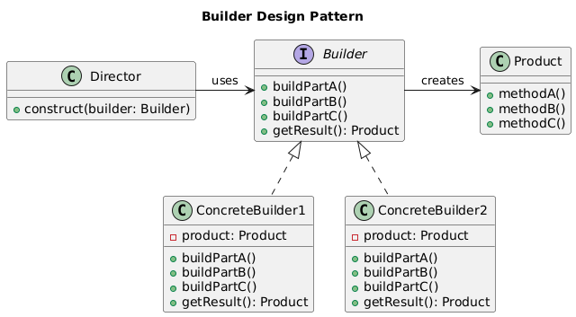

# Builder Design Pattern

Lets consider an example first.

## DatabaseConnection Example

### Without the Builder Pattern

Let’s consider a scenario where we need to create a DatabaseConnection object. Without the Builder pattern, the constructor may require several parameters, making it cumbersome and error-prone.

```cpp

#include <iostream>
#include <string>

class DatabaseConnection {
public:
    DatabaseConnection(const std::string& host, int port, const std::string& username, const std::string& password, const std::string& database)
        : host_(host), port_(port), username_(username), password_(password), database_(database) {}

    void connect() {
        std::cout << "Connecting to database at " << host_ << ":" << port_ << " as user " << username_ << "\n";
        // Add connection logic here
    }

private:
    std::string host_;
    int port_;
    std::string username_;
    std::string password_;
    std::string database_;
};

int main() {
    //without builder pattern the code is combursome and error prone

    DatabaseConnection dbConn("localhost", 3306, "admin", "admin123", "example_db");
    dbConn.connect();

    return 0;
}
```

### With Builder

```cpp
#include <iostream>
#include <string>

class DatabaseConnection {
public:
    void setHost(const std::string& host) { host_ = host; }
    void setPort(int port) { port_ = port; }
    void setUsername(const std::string& username) { username_ = username; }
    void setPassword(const std::string& password) { password_ = password; }
    void setDatabase(const std::string& database) { database_ = database; }

    void connect() {
        std::cout << "Connecting to database at " << host_ << ":" << port_ << " as user " << username_ << "\n";
        // Add connection logic here
    }

private:
    std::string host_;
    int port_;
    std::string username_;
    std::string password_;
    std::string database_;
};

class DatabaseConnectionBuilder {
public:
    DatabaseConnectionBuilder() : dbConn_(new DatabaseConnection()) {}

    DatabaseConnectionBuilder& withHost(const std::string& host) {
        dbConn_->setHost(host);
        return *this;
    }

    DatabaseConnectionBuilder& withPort(int port) {
        dbConn_->setPort(port);
        return *this;
    }

    DatabaseConnectionBuilder& withUsername(const std::string& username) {
        dbConn_->setUsername(username);
        return *this;
    }

    DatabaseConnectionBuilder& withPassword(const std::string& password) {
        dbConn_->setPassword(password);
        return *this;
    }

    DatabaseConnectionBuilder& withDatabase(const std::string& database) {
        dbConn_->setDatabase(database);
        return *this;
    }

    DatabaseConnection* build() {
        return dbConn_;
    }

private:
    DatabaseConnection* dbConn_;
};

int main() {
    // Building a PostgreSQL connection this is pretty neat using builder
    DatabaseConnection* postgreSQLConn = DatabaseConnectionBuilder()
        .withHost("localhost")
        .withPort(5432)
        .withUsername("postgres")
        .withPassword("postgres123")
        .withDatabase("example_db")
        .build();

    postgreSQLConn->connect();

    // Building a MySQL connection
    DatabaseConnection* mySQLConn = DatabaseConnectionBuilder()
        .withHost("localhost")
        .withPort(3306)
        .withUsername("mysql_user")
        .withPassword("mysql123")
        .withDatabase("example_db")
        .build();

    mySQLConn->connect();

    // Clean up
    delete postgreSQLConn;
    delete mySQLConn;

    return 0;
}
```

#### Explanation

- `DatabaseConnectionBuilder`: This class still provides the same step-by-step methods to set the different properties of the DatabaseConnection object. However, in this case, the construction process is directly managed within the main function.

- `Main Function`: The main function now acts as the client, using the builder to create different types of database connections (e.g., PostgreSQL, MySQL) without relying on a Director class. This gives more flexibility but requires the client to know the specific steps for constructing each configuration.

### With Builder Including Director

```cpp
#include <iostream>
#include <string>

class DatabaseConnection {
public:
    void setHost(const std::string& host) { host_ = host; }
    void setPort(int port) { port_ = port; }
    void setUsername(const std::string& username) { username_ = username; }
    void setPassword(const std::string& password) { password_ = password; }
    void setDatabase(const std::string& database) { database_ = database; }

    void connect() {
        std::cout << "Connecting to database at " << host_ << ":" << port_ << " as user " << username_ << "\n";
        // Add connection logic here
    }

private:
    std::string host_;
    int port_;
    std::string username_;
    std::string password_;
    std::string database_;
};

class DatabaseConnectionBuilder {
public:
    DatabaseConnectionBuilder() : dbConn_(new DatabaseConnection()) {}

    DatabaseConnectionBuilder& withHost(const std::string& host) {
        dbConn_->setHost(host);
        return *this;
    }

    DatabaseConnectionBuilder& withPort(int port) {
        dbConn_->setPort(port);
        return *this;
    }

    DatabaseConnectionBuilder& withUsername(const std::string& username) {
        dbConn_->setUsername(username);
        return *this;
    }

    DatabaseConnectionBuilder& withPassword(const std::string& password) {
        dbConn_->setPassword(password);
        return *this;
    }

    DatabaseConnectionBuilder& withDatabase(const std::string& database) {
        dbConn_->setDatabase(database);
        return *this;
    }

    DatabaseConnection* build() {
        return dbConn_;
    }

private:
    DatabaseConnection* dbConn_;
};

// Director Class
class DatabaseConnectionDirector {
public:
    DatabaseConnection* createPostgreSQLConnection(DatabaseConnectionBuilder& builder) {
        return builder.withHost("localhost")
                      .withPort(5432)
                      .withUsername("postgres")
                      .withPassword("postgres123")
                      .withDatabase("example_db")
                      .build();
    }

    DatabaseConnection* createMySQLConnection(DatabaseConnectionBuilder& builder) {
        return builder.withHost("localhost")
                      .withPort(3306)
                      .withUsername("mysql_user")
                      .withPassword("mysql123")
                      .withDatabase("example_db")
                      .build();
    }
};

int main() {
    DatabaseConnectionBuilder builder;
    DatabaseConnectionDirector director;

    DatabaseConnection* postgreSQLConn = director.createPostgreSQLConnection(builder);
    postgreSQLConn->connect();

    DatabaseConnection* mySQLConn = director.createMySQLConnection(builder);
    mySQLConn->connect();

    delete postgreSQLConn;
    delete mySQLConn;

    return 0;
}
```

#### Explanation

- `Builder Class (DatabaseConnectionBuilder)`: This class provides methods to set the different properties of the DatabaseConnection object, allowing you to construct the object step by step.

- `Director Class (DatabaseConnectionDirector)`: This class defines the order in which to call the builder methods to construct a specific configuration of the DatabaseConnection object. It encapsulates the construction logic.

#### Use Case of the Director Class

- The `Director` class is useful when you need to construct complex objects that follow specific configurations. 
- For example, in the case of different types of database connections (e.g., `PostgreSQL`, `MySQL`), the `Director` knows the order and combination of steps required to construct each type of connection, ensuring that the process is consistent and correct.

## Description

- The Builder design pattern is a creational pattern that separates the construction of a complex object from its representation.
- It allows for the creation of different representations of the same object.

## Class Diagram

