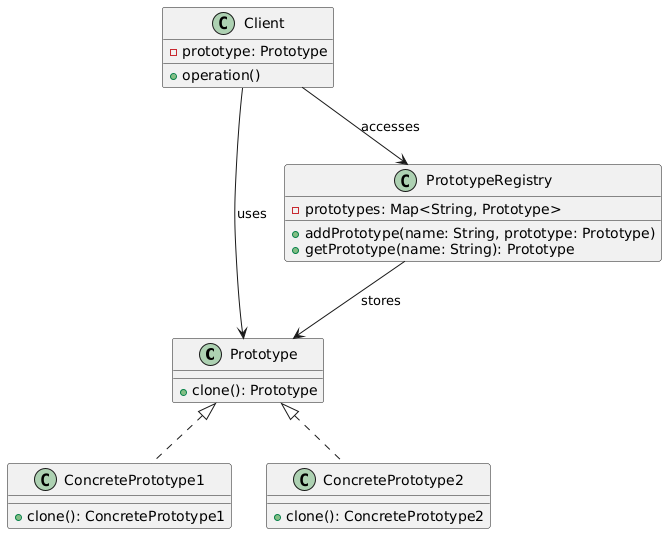

# Protype Design Pattern

Lets consider an example first.

## Shapes Example

### Without Prototype Pattern (Naive Approach)

Let's consider a Shape class with a draw() method and two subclasses, Circle and Rectangle. We want to create copies of these shapes.

```C++
#include <iostream>

class Shape {
public:
    virtual void draw() = 0;
};

class Circle : public Shape {
public:
    void draw() override {
        std::cout << "Drawing a circle." << std::endl;
    }
};

class Rectangle : public Shape {
public:
    void draw() override {
        std::cout << "Drawing a rectangle." << std::endl;
    }
};

int main() {
    Circle circle;
    Rectangle rectangle;

    // Create copies of shapes (naive approach)
    Circle circleCopy = circle;
    Rectangle rectangleCopy = rectangle;

    circleCopy.draw();
    rectangleCopy.draw();

    return 0;
}
```

### With Prototype Pattern

Using the Prototype pattern, we can create a ShapePrototype class that manages a registry of shape prototypes. Each shape subclass implements the clone() function to create a new copy of itself.

```C++
#include <iostream>
#include <map>
#include <string>

// Abstract Shape class with clone() function
class Shape {
public:
    virtual ~Shape() {}
    virtual Shape* clone() = 0;
    virtual void display() = 0;
};

// Concrete Shape classes
class Circle : public Shape {
public:
    Circle(std::string color, int radius) : color_(color), radius_(radius) {}
    Shape* clone() override {
        return new Circle(*this);
    }
    void display() override {
        std::cout << "Circle: Color=" << color_ << ", Radius=" << radius_ << std::endl;
    }

private:
    std::string color_;
    int radius_;
};

class Rectangle : public Shape {
public:
    Rectangle(std::string color, int width, int height) : color_(color), width_(width), height_(height) {}
    Shape* clone() override {
        return new Rectangle(*this);
    }
    void display() override {
        std::cout << "Rectangle: Color=" << color_ << ", Width=" << width_ << ", Height=" << height_ << std::endl;
    }

private:
    std::string color_;
    int width_;
    int height_;
};

// ShapePrototype class managing registry of prototypes
class ShapePrototype {
public:
    void registerPrototype(const std::string& name, Shape* prototype) {
        prototypes_[name] = prototype;
    }

    Shape* create(const std::string& name) {
        return prototypes_[name]->clone();
    }

private:
    std::map<std::string, Shape*> prototypes_;
};

int main() {
    ShapePrototype prototype;

    // Register prototypes
    prototype.registerPrototype("Circle", new Circle("Red", 10));
    prototype.registerPrototype("Rectangle", new Rectangle("Blue", 20, 30));

    // Create new shapes by cloning prototypes
    Shape* circle = prototype.create("Circle");
    circle->display();

    Shape* rectangle = prototype.create("Rectangle");
    rectangle->display();

    delete circle;
    delete rectangle;

    return 0;
}
```

## Description

The Prototype design pattern is a creational pattern that allows you to create a new object by copying an existing object, called the prototype. This pattern is useful when the type of objects to create is determined by a prototypical instance, and creating a new object by copying the prototype is more efficient than creating a new object from scratch

## Class Diagram



## When to use Prototype Pattern

The Prototype pattern is useful in scenarios where:

1. Object creation is expensive or complex.
2. Objects need to be copied or cloned frequently.
3. Objects have many properties that need to be copied.
4. Object types are unknown until runtime
