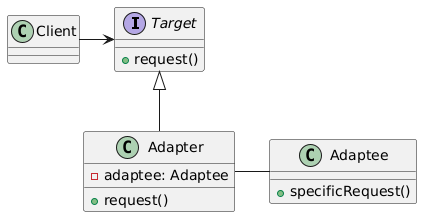

# Adapter Pattern

Let us consider the below example.

## Without Adapter Pattern

Let's consider an example of a TwoPinSocket and a ThreePinSocket. We have a Bulb that can be plugged into a TwoPinSocket, but we want to plug it into a ThreePinSocket.

```C++
// Without Adapter Pattern

class Bulb {
public:
    void plugIntoThreePinSocket(ThreePinSocket* socket) {
        socket->plugIn(this);
    }
};

class TwoPinSocket {
public:
    void plugIn(Bulb* bulb) {
        // This won't work because Bulb expects a ThreePinSocket
    }
};

class ThreePinSocket {
public:
    void plugIn(Bulb* bulb) {
        std::cout << "Bulb plugged into ThreePinSocket" << std::endl;
    }
};

int main() {
    Bulb bulb;
    ThreePinSocket threePinSocket;
    bulb.plugIntoThreePinSocket(&threePinSocket);

    // We can't plug the bulb into the TwoPinSocket because it expects a different interface
    // TwoPinSocket twoPinSocket;
    // bulb.plugIntoTwoPinSocket(&twoPinSocket); // Error

    return 0;
}
```

## With Adapter Pattern

Now, let's introduce an Adapter that will convert the interface of the TwoPinSocket to match the Bulb.

```C++
// With Adapter Pattern

class Bulb {
public:
    void plugIntoThreePinSocket(ThreePinSocket* socket) {
        socket->plugIn(this);
    }
};

class TwoPinSocket {
public:
    virtual void plugIn(TwoPinSocketAdapter* adapter) = 0;
};

class TwoPinSocketAdapter : public ThreePinSocket {
public:
    TwoPinSocketAdapter(TwoPinSocket* socket) : socket_(socket) {}

    void plugIn(Bulb* bulb) {
        std::cout << "Bulb plugged into TwoPinSocket using TwoPinSocketAdapter" << std::endl;
        socket_->plugIn(this);
    }

private:
    TwoPinSocket* socket_;
};

class ThreePinSocket {
public:
    void plugIn(Bulb* bulb) {
        std::cout << "Bulb plugged into ThreePinSocket" << std::endl;
    }
};

int main() {
    Bulb bulb;
    ThreePinSocket threePinSocket;
    bulb.plugIntoThreePinSocket(&threePinSocket);

    TwoPinSocket twoPinSocket;
    TwoPinSocketAdapter adapter(&twoPinSocket);
    adapter.plugIn(&bulb); // Now we can plug the bulb into the TwoPinSocket using the adapter

    return 0;
}
```

## Description

The Adapter design pattern is a structural pattern that allows two incompatible objects to work together by converting the interface of one object into an interface expected by the other object

## Class Diagram



## Use Cases

1. **Legacy System Integration:** Adapting legacy systems to work with new systems or technologies.
2. **Third-Party Library Integration:** Adapting third-party libraries to match your application's interface.
3. **Database Migration:** Adapting an application to work with a different database system.
4. **File Format Conversion:** Adapting an application to work with different file formats.