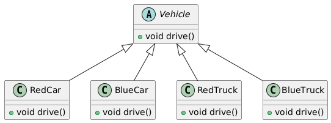
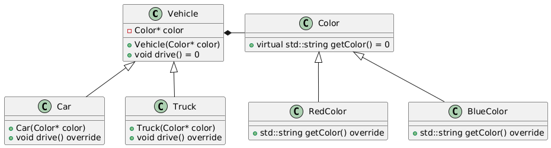
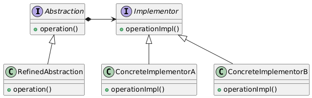

# Bridge Pattern

Let us consider the below example.

## Without Bridge Pattern

Suppose we have a `Vehicle` class that has two responsibilities: `Color` and `Type`. Without the Bridge pattern, we might create a class hierarchy like this:

```C++
class Vehicle {
public:
    virtual void drive() = 0;
};

class RedCar : public Vehicle {
public:
    void drive() override {
        std::cout << "Driving a red car." << std::endl;
    }
};

class BlueCar : public Vehicle {
public:
    void drive() override {
        std::cout << "Driving a blue car." << std::endl;
    }
};

class RedTruck : public Vehicle {
public:
    void drive() override {
        std::cout << "Driving a red truck." << std::endl;
    }
};

class BlueTruck : public Vehicle {
public:
    void drive() override {
        std::cout << "Driving a blue truck." << std::endl;
    }
};
```

### Class Diagram



### Problems

We have a class explosion, with a new class for each color and type combination.
Adding a new color or type requires modifying the existing hierarchy.

## With Bridge Pattern

Using the Bridge pattern, we can separate the Color and Type responsibilities into separate hierarchies:

```C++
// Abstraction
class Vehicle {
protected:
    Color* color;
public:
    Vehicle(Color* color) : color(color) {}
    virtual void drive() = 0;
};

// Refined Abstraction
class Car : public Vehicle {
public:
    Car(Color* color) : Vehicle(color) {}
    void drive() override {
        std::cout << "Driving a car with " << color->getColor() << " color." << std::endl;
    }
};

class Truck : public Vehicle {
public:
    Truck(Color* color) : Vehicle(color) {}
    void drive() override {
        std::cout << "Driving a truck with " << color->getColor() << " color." << std::endl;
    }
};

// Implementation
class Color {
public:
    virtual std::string getColor() = 0;
};

// Concrete Implementations
class RedColor : public Color {
public:
    std::string getColor() override {
        return "red";
    }
};

class BlueColor : public Color {
public:
    std::string getColor() override {
        return "blue";
    }
};
```

**In this example, we have:**

- `Vehicle` as the abstraction, which delegates to a `Color` object.
- `Car` and `Truck` as refined abstractions, which inherit from Vehicle.
- `Color` as the implementation, with concrete implementations `RedColor` and `BlueColor`.

This approach allows us to add new colors or types independently, without modifying the existing hierarchy.

### Class Diagram



## Description

The Bridge pattern is a structural design pattern that separates an object's abstraction from its implementation, allowing them to vary independently. This pattern is useful when you have a class with multiple responsibilities that need to be separated, or when you want to decouple an abstraction from its implementation

## Class Diagram

