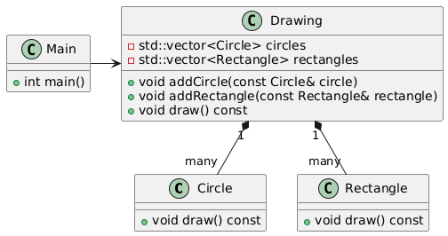
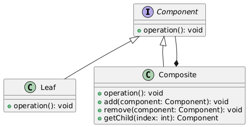

# Compostie Pattern

Let us consider the below example.

## Example Without Composite Pattern

Let's say you are creating a simple graphics editor. Without using the Composite Pattern, you might have individual classes for each shape and manage them separately.

Here’s how you might define classes for Circle and Rectangle:

```cpp
#include <iostream>
#include <vector>

class Circle {
public:
    void draw() const {
        std::cout << "Drawing a circle\n";
    }
};

class Rectangle {
public:
    void draw() const {
        std::cout << "Drawing a rectangle\n";
    }
};

class Drawing {
private:
    std::vector<Circle> circles;
    std::vector<Rectangle> rectangles;

public:
    void addCircle(const Circle& circle) {
        circles.push_back(circle);
    }

    void addRectangle(const Rectangle& rectangle) {
        rectangles.push_back(rectangle);
    }

    void draw() const {
        for (const auto& circle : circles) {
            circle.draw();
        }
        for (const auto& rectangle : rectangles) {
            rectangle.draw();
        }
    }
};

int main() {
    Drawing drawing;
    drawing.addCircle(Circle());
    drawing.addRectangle(Rectangle());
    drawing.draw();
    return 0;
}
```

In this example, the Drawing class manages both Circle and Rectangle objects separately. If you wanted to add more types of shapes, you'd need to modify the Drawing class to handle each new type.

### Class Diagram



## Example With Composite Pattern

Using the Composite Pattern, you can define a common interface for all components and then create a composite that can hold other components.

Here’s how you can use the Composite Pattern to handle shapes:

```cpp
#include <iostream>
#include <vector>
#include <memory>

class Component {
public:
    virtual ~Component() {}
    virtual void draw() const = 0;
};

class Circle : public Component {
public:
    void draw() const override {
        std::cout << "Drawing a circle\n";
    }
};

class Rectangle : public Component {
public:
    void draw() const override {
        std::cout << "Drawing a rectangle\n";
    }
};

class Composite : public Component {
private:
    std::vector<std::shared_ptr<Component>> children;

public:
    void add(const std::shared_ptr<Component>& component) {
        children.push_back(component);
    }

    void remove(const std::shared_ptr<Component>& component) {
        children.erase(std::remove(children.begin(), children.end(), component), children.end());
    }

    void draw() const override {
        for (const auto& child : children) {
            child->draw();
        }
    }
};

int main() {
    auto circle1 = std::make_shared<Circle>();
    auto rectangle1 = std::make_shared<Rectangle>();
    auto composite = std::make_shared<Composite>();

    composite->add(circle1);
    composite->add(rectangle1);

    composite->draw();  // Draws all shapes within the composite
    return 0;
}
```

In this example, the `Component` class is an abstract base class for all shapes. The `Circle` and `Rectangle` classes derive from `Component` and implement the `draw` method. The `Composite` class also derives from `Component` and holds a collection of `Component` objects, allowing it to manage and draw all its children uniformly.

### Class Diagram


## Description

The Composite Pattern is a structural design pattern that lets you compose objects into tree-like structures to represent part-whole hierarchies. It allows clients to treat individual objects and compositions of objects uniformly.

### Class Diagram

