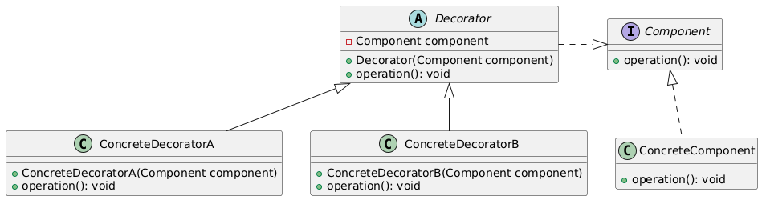

# Decorator Pattern

Let us consider the following example.

## Without Decorator Pattern

Let's say we have a beverage shop that serves both `coffee` and `tea`. We want to add flavorings like `milk`, `sugar`, or `both` to either `coffee` or `tea`.

We could create subclasses for each combination:

```C++
class Beverage {
public:
    virtual void make() = 0;
};

class Coffee : public Beverage {
public:
    void make() override {
        std::cout << "Making coffee..." << std::endl;
    }
};

class Tea : public Beverage {
public:
    void make() override {
        std::cout << "Making tea..." << std::endl;
    }
};

class CoffeeWithMilk : public Coffee {
public:
    void make() override {
        Coffee::make();
        std::cout << "Adding milk..." << std::endl;
    }
};

class CoffeeWithSugar : public Coffee {
public:
    void make() override {
        Coffee::make();
        std::cout << "Adding sugar..." << std::endl;
    }
};

class CoffeeWithMilkAndSugar : public Coffee {
public:
    void make() override {
        Coffee::make();
        std::cout << "Adding milk and sugar..." << std::endl;
    }
};

class TeaWithMilk : public Tea {
public:
    void make() override {
        Tea::make();
        std::cout << "Adding milk..." << std::endl;
    }
};

class TeaWithSugar : public Tea {
public:
    void make() override {
        Tea::make();
        std::cout << "Adding sugar..." << std::endl;
    }
};

class TeaWithMilkAndSugar : public Tea {
public:
    void make() override {
        Tea::make();
        std::cout << "Adding milk and sugar..." << std::endl;
    }
};
```

## With Decorator Pattern

Let's apply the Decorator pattern to solve this problem:

```C++
// Component interface
class Beverage {
public:
    virtual void make() = 0;
};

// Concrete components
class Coffee : public Beverage {
public:
    void make() override {
        std::cout << "Making coffee..." << std::endl;
    }
};

class Tea : public Beverage {
public:
    void make() override {
        std::cout << "Making tea..." << std::endl;
    }
};

// Decorator base class
class BeverageDecorator : public Beverage {
protected:
    Beverage* beverage;
public:
    BeverageDecorator(Beverage* b) : beverage(b) {}
    void make() override {
        beverage->make();
    }
};

// Concrete decorators
class MilkDecorator : public BeverageDecorator {
public:
    MilkDecorator(Beverage* b) : BeverageDecorator(b) {}
    void make() override {
        BeverageDecorator::make();
        std::cout << "Adding milk..." << std::endl;
    }
};

class SugarDecorator : public BeverageDecorator {
public:
    SugarDecorator(Beverage* b) : BeverageDecorator(b) {}
    void make() override {
        BeverageDecorator::make();
        std::cout << "Adding sugar..." << std::endl;
    }
};

int main() {
    Beverage* coffee = new Coffee();
    coffee = new MilkDecorator(coffee);
    coffee = new SugarDecorator(coffee);
    coffee->make();
    delete coffee;

    Beverage* tea = new Tea();
    tea = new MilkDecorator(tea);
    tea = new SugarDecorator(tea);
    tea->make();
    delete tea;

    return 0;
}
```

## Description

The Decorator pattern is a structural design pattern that allows you to dynamically add new behaviors or responsibilities to an object without modifying its implementation. It's a wrapper that adds additional functionality to an object without changing its external interface.

## Class Diagram

