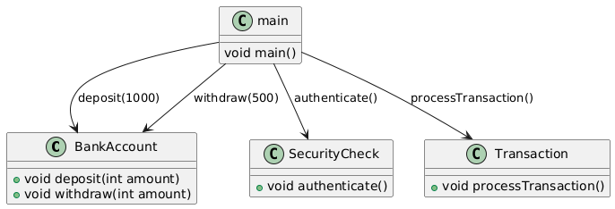
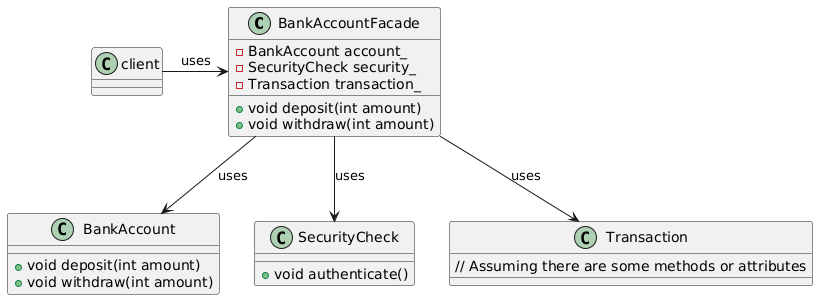

# Facade Design Pattern

Let us consider the below example.

## Bank Account System

Let's consider a software engineering example of a Bank Account System.

### Without Facade Pattern

```C++
// Complex subsystem classes
class BankAccount {
public:
    void deposit(int amount) { /* implementation */ }
    void withdraw(int amount) { /* implementation */ }
};

class SecurityCheck {
public:
    void authenticate() { /* implementation */ }
};

class Transaction {
public:
    void processTransaction() { /* implementation */ }
};

// Client code
int main() {
    BankAccount account;
    SecurityCheck security;
    Transaction transaction;

    // Complex usage
    security.authenticate();
    account.deposit(1000);
    transaction.processTransaction();
    account.withdraw(500);

    return 0;
}
```

#### Class Diagram



### With Facade Pattern

```C++
// Facade class
class BankAccountFacade {
public:
    void deposit(int amount) {
        security_.authenticate();
        account_.deposit(amount);
    }

    void withdraw(int amount) {
        security_.authenticate();
        account_.withdraw(amount);
    }

private:
    BankAccount account_;
    SecurityCheck security_;
    Transaction transaction_;
};

// Client code
int main() {
    BankAccountFacade facade;

    // Simplified usage
    facade.deposit(1000);
    facade.withdraw(500);

    return 0;
}
```

- In the example without the `Facade` pattern, the client code needs to interact with multiple complex subsystem classes (`BankAccount`, `SecurityCheck`, and `Transaction`).
- With the Facade pattern, we introduce a `BankAccountFacade` class that provides a simplified interface to the client.
- The `facade` class hides the complexities of the subsystem classes and provides a single interface for the client to use.

#### Class Diagram



**The benefits of using the Facade pattern include:**

1. Simplified interface for the client
2. Reduced coupling between client and subsystem classes
3. Improved readability and maintainability of code
