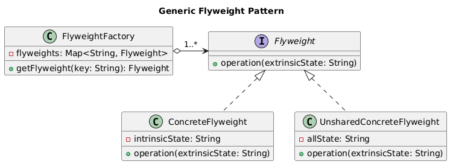

# Flyweight Design Pattern

Let us consider the below example.

## Charecter and Texteditor Example

Let's consider a software engineering example of a `Text Editor`.

### Example without Flyweight

```cpp
#include <iostream>
#include <vector>
#include <string>

class Character {
public:
    char symbol;
    std::string font;
    int size;
    std::string color;

    Character(char s, const std::string &f, int sz, const std::string &c)
        : symbol(s), font(f), size(sz), color(c) {}

    void display() {
        std::cout << "Character: " << symbol << ", Font: " << font
                  << ", Size: " << size << ", Color: " << color << std::endl;
    }
};

int main() {
    std::vector<Character*> text;
    
    // Adding characters to the text editor
    text.push_back(new Character('H', "Arial", 12, "Black"));
    text.push_back(new Character('e', "Arial", 12, "Black"));
    text.push_back(new Character('l', "Arial", 12, "Black")); //creates multiple object for same l
    text.push_back(new Character('l', "Arial", 12, "Black")); //creates multiple object for same l
    text.push_back(new Character('o', "Arial", 12, "Black"));

    // Display all characters
    for (Character* ch : text) {
        ch->display();
    }

    // Free memory
    for (Character* ch : text) {
        delete ch;
    }

    return 0;
}
```

**Issues:**

- **Redundant Objects:** In the example above, the characters `'l'` and other characters share the same properties (`font`, `size`, `color`), yet we create separate objects for each.
- **Memory Inefficiency:** This approach consumes more memory because of redundant objects.

### Example with Flyweight

```cpp
#include <iostream>
#include <vector>
#include <unordered_map>
#include <string>

// Flyweight class that includes all character properties
class CharacterFlyweight {
public:
    char symbol;
    std::string font;
    int size;
    std::string color;

    CharacterFlyweight(char s, const std::string &f, int sz, const std::string &c)
        : symbol(s), font(f), size(sz), color(c) {}

    void display() {
        std::cout << "Character: " << symbol << ", Font: " << font
                  << ", Size: " << size << ", Color: " << color << std::endl;
    }
};

// Flyweight Factory
class CharacterFactory {
    std::unordered_map<std::string, CharacterFlyweight*> characters;
public:
    CharacterFlyweight* getCharacter(char symbol, const std::string &font, int size, const std::string &color) {
        std::string key = std::string(1, symbol) + "_" + font + "_" + std::to_string(size) + "_" + color;
        if (characters.find(key) == characters.end()) {
            characters[key] = new CharacterFlyweight(symbol, font, size, color);
        }
        return characters[key];
    }

    ~CharacterFactory() {
        for (auto &pair : characters) {
            delete pair.second;
        }
    }
};

int main() {
    CharacterFactory factory;
    std::vector<CharacterFlyweight*> text;

    // Adding characters with shared flyweights to the text editor
    text.push_back(factory.getCharacter('H', "Arial", 12, "Black"));
    text.push_back(factory.getCharacter('e', "Arial", 12, "Black"));
    text.push_back(factory.getCharacter('l', "Arial", 12, "Black"));
    text.push_back(factory.getCharacter('l', "Arial", 12, "Black"));
    text.push_back(factory.getCharacter('o', "Arial", 12, "Black"));

    // Display all characters
    for (CharacterFlyweight* ch : text) {
        ch->display();
    }

    return 0;
}
```

**Benefits:**

- **Memory Efficiency:** Even with the font, size, and color as part of the Flyweight, the memory usage is still optimized because identical character properties are shared.
- **Object Reuse:** By sharing common objects, the application can handle a large number of characters without duplicating memory for identical properties.

## Description

The Flyweight Pattern is a structural design pattern that helps reduce the memory usage of applications by sharing as much data as possible with similar objects. It is particularly useful when dealing with a large number of objects that share common data.

## Class Diagram



**When to Use UnsharedConcreteFlyweight?**
Use the `UnsharedConcreteFlyweight` when you have objects that:

- Have unique properties that cannot be shared.
- Need to maintain their own state independently of other objects.
- Are exceptions to the general shared behavior provided by the Flyweight pattern.
