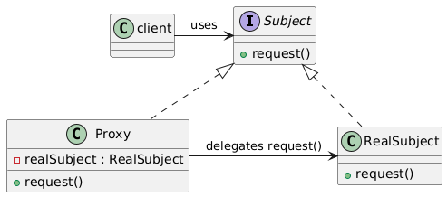

# Proxy

Let us consider the following example.

## Heavy Object Example

Suppose we have a `HeavyObject` class that represents a resource-intensive object:

### Without Proxy

Without the `Proxy` pattern, the `HeavyObject` is created directly, and all the initialization happens immediately when the object is instantiated.

```cpp
#include <iostream>
#include <string>

class HeavyObject {
public:
    HeavyObject() {
        // Simulate heavy initialization
        std::cout << "HeavyObject: Initialized with heavy resources...\n";
    }

    void performAction() {
        std::cout << "HeavyObject: Performing action...\n";
    }
};

int main() {
    std::cout << "Main: Creating HeavyObject...\n";
    HeavyObject heavyObj;
    std::cout << "Main: HeavyObject created.\n";
    
    heavyObj.performAction(); // Perform some action with the object
    return 0;
}
```

In this example, `HeavyObject` is created immediately, and the initialization happens upfront, regardless of whether the object is actually used or not.

### With Proxy Pattern

Using the `Proxy` pattern, you can delay the creation of the `HeavyObject` until it's actually needed. The proxy acts as a stand-in for the `HeavyObject` and only initializes it when necessary.

```cpp
#include <iostream>
#include <memory>

// The real HeavyObject
class HeavyObject {
public:
    HeavyObject() {
        // Simulate heavy initialization
        std::cout << "HeavyObject: Initialized with heavy resources...\n";
    }

    void performAction() {
        std::cout << "HeavyObject: Performing action...\n";
    }
};

// The Proxy class
class HeavyObjectProxy {
private:
    std::unique_ptr<HeavyObject> heavyObj; // Pointer to the real object

public:
    HeavyObjectProxy() : heavyObj(nullptr) {}

    void performAction() {
        if (!heavyObj) {
            std::cout << "Proxy: Initializing HeavyObject on demand...\n";
            heavyObj = std::make_unique<HeavyObject>(); // Lazy initialization
        }
        heavyObj->performAction();
    }
};

int main() {
    std::cout << "Main: Creating Proxy for HeavyObject...\n";
    HeavyObjectProxy proxyObj;
    std::cout << "Main: Proxy created. HeavyObject not yet initialized.\n";
    
    proxyObj.performAction(); // HeavyObject is created here, only when needed
    return 0;
}
```

## Benefits

- **Lazy initialization:** Create objects only when needed
- **Reduced memory usage:** Avoid creating unnecessary objects

## Description

The Proxy Pattern is a structural design pattern that provides a surrogate or placeholder for another object to control access to it. In simpler terms, the Proxy pattern allows you to create an object that acts as an interface to another object, which might be resource-intensive to create or access directly.

## Class Diagram


